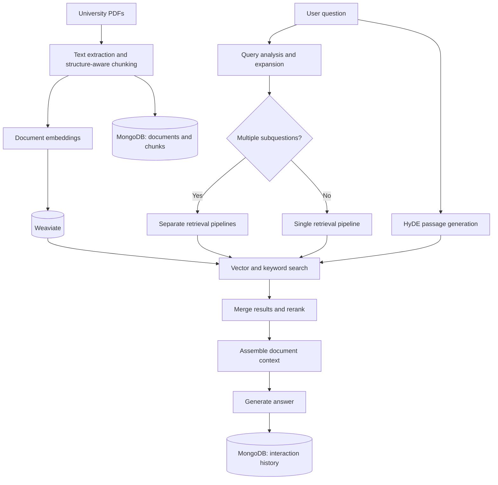

# Advanced RAG

### A university assistant shaped by real user questions

I built and deployed this document question-answering system for **Ankara Bilim Üniversitesi**. It helps users ask questions about university information in natural language and find answers grounded in university documents.

The project evolved through a hands-on feedback loop: I exported real questions and generated answers from the database, reviewed them myself with AI assistance, and used the failures I found to guide the next changes. HyDE and question decomposition were responses to problems I encountered in that process.

**Python · FastAPI · Weaviate · MongoDB · OpenAI · Sentence Transformers · Whisper**

[Development approach](#development-driven-by-real-usage) · [Architecture](#how-it-works) · [Local setup](#local-setup) · [Code guide](#code-guide)

## Development driven by real usage

After deployment, I would sit down at night with the questions users had asked and the answers the system had returned. I reviewed those interactions manually, using AI to help inspect them, then shipped fixes based on what I found. That review became a recurring part of development.

```text
Real questions → Stored interactions → Manual + AI-assisted review → Targeted fixes
      ↑                                                                   │
      └────────────────────── Continued usage ─────────────────────────────┘
```

Two examples explain how this shaped the retrieval pipeline:

### 1. Bridging the gap between questions and document language

**What I observed:** Users phrased questions differently from the passages that contained the answers. Searching with the question alone did not always surface the relevant information.

**What I changed:** I introduced **HyDE (Hypothetical Document Embeddings)**. The system generates a hypothetical answer passage and uses it as an additional retrieval query alongside the original question and its variants. This gives retrieval an answer-shaped representation to search with.

The hypothetical passage is a retrieval aid. The final answer is generated from retrieved document context, with instructions to cite its sources.

**Implementation:** [HyDE generation](https://github.com/yigittcode/Advanced-RAG/blob/main/hyde_generator.py), [query embeddings](https://github.com/yigittcode/Advanced-RAG/blob/main/embedding_engine.py), and [pipeline orchestration](https://github.com/yigittcode/Advanced-RAG/blob/main/rag_orchestrator.py).

### 2. Handling several questions in one message

**What I observed:** A single message could contain four separate questions. Treating the whole message as one retrieval query made it difficult to find relevant context for each part.

**What I changed:** I added **query decomposition**. When the query analysis identifies multiple subquestions, the orchestrator retrieves context for each one through a separate pipeline. These pipelines run concurrently, and their contexts are combined before generating the final response.

For example, a message might ask about scholarships, dormitories, language preparation, and course withdrawal together. This is an illustrative example: each topic gets its own retrieval step before the system answers the original message.

**Implementation:** [Query analysis and expansion](https://github.com/yigittcode/Advanced-RAG/blob/main/query_processor.py) and the per-question retrieval flow in [RAGOrchestrator](https://github.com/yigittcode/Advanced-RAG/blob/main/rag_orchestrator.py).

The main lesson was that improving a RAG system requires looking at the entire path from a user's question to the retrieved evidence and final answer. Real conversations gave me concrete reasons to change that path.

## How it works



The implementation also includes:

| Component | Role |
| --- | --- |
| Structure-aware PDF processing | Detects articles, headings, and sections to create chunks with source metadata. |
| Query expansion | Produces paraphrases and domain-specific variants, including Turkish university terminology. |
| Hybrid retrieval | Combines vector similarity and keyword search, with progressive search widening when results score poorly. |
| Cross-encoder reranking | Reorders retrieved candidates using the question and candidate text together. |
| Context assembly | Scores and formats retrieved passages for response generation. |
| Source-aware generation | Prompts the model to answer from supplied context and cite document references in text responses. |
| Streaming and voice | Exposes streaming text, speech-to-speech, and text-to-speech endpoints. |
| Document administration | Supports JWT-protected uploads, document inspection, deletion, and upload progress tracking. |
| Interaction logging | Stores questions, answers, timestamps, and interaction types for later review. |
| Caching and concurrency | Uses TTL caches and concurrent tasks across query processing and retrieval. |

This repository contains the **backend API**. It can be explored through FastAPI's interactive documentation or connected to a separate client.

## Technology and models

| Layer | Current implementation |
| --- | --- |
| API | FastAPI, Uvicorn |
| Vector storage | Weaviate; the included Compose file uses `1.25.4` |
| Document and interaction storage | MongoDB |
| Embeddings | `intfloat/multilingual-e5-large` |
| Reranking | `cross-encoder/ms-marco-MiniLM-L-12-v2` |
| Answer generation | `gpt-4o` |
| HyDE and query analysis | `gpt-4o-mini` |
| PDF extraction | pypdf |
| Speech recognition | Whisper `small`, loaded on CPU |
| Speech synthesis | Edge TTS with Turkish voice options |

Model settings and university-specific prompts are in [config.py](https://github.com/yigittcode/Advanced-RAG/blob/main/config.py). Some query-processing model choices and domain rules also live in their respective modules.

## Local setup

### Prerequisites

- Python 3.11 as a suggested starting environment.
- Docker with Compose for the included Weaviate service.
- A reachable MongoDB instance, local or hosted.
- An OpenAI API key with access to the configured models.
- FFmpeg for Whisper and the native audio dependencies needed by PyAudio/pygame. See the [Whisper setup instructions](https://github.com/openai/whisper#setup) and [PyAudio installation guide](https://people.csail.mit.edu/hubert/pyaudio/).

The application loads embedding, reranking, and speech models at startup, so the first run may download model weights. Speech initialization currently runs even when only text endpoints are used, including initialization of the pygame audio mixer.

### 1. Install dependencies

```bash
git clone https://github.com/yigittcode/Advanced-RAG.git
cd Advanced-RAG

python3.11 -m venv .venv
source .venv/bin/activate
python -m pip install -r requirements.txt
```

On Windows, activate the environment with `.venv\Scripts\Activate.ps1` in PowerShell.

### 2. Configure the environment

Create a `.env` file in the repository root:

```dotenv
OPENAI_API_KEY=your-openai-api-key

JWT_SECRET_KEY=replace-with-a-long-random-secret
JWT_EXPIRE_MINUTES=1440
ADMIN_EMAIL=admin@example.com
ADMIN_PASSWORD=replace-with-your-own-password

MONGODB_URL=mongodb://localhost:27017
MONGODB_DB_NAME=advanced_rag
MONGODB_COLLECTION_NAME=documents

PERSISTENT_COLLECTION_NAME=IntelliDocs_Documents
```

Replace the example credentials and use your MongoDB connection URI. `JWT_EXPIRE_MINUTES` must be set because configuration parses it as an integer at import time. `MONGODB_COLLECTION_NAME` is read by configuration; the current MongoDB manager uses named collections internally.

### 3. Start storage and the API

```bash
docker compose up -d
python -m uvicorn api_backend:app --host 127.0.0.1 --port 8000
```

The Compose file starts **Weaviate only**, exposing HTTP on port `8009` and gRPC on `50051`. MongoDB must be running separately at the URI configured above.

Open [interactive API documentation](http://localhost:8000/docs) or inspect the [health endpoint](http://localhost:8000/health).

### 4. Upload documents and ask a question

In the interactive API documentation:

1. Call `POST /api/login` with the admin email and password from `.env`.
2. Copy the returned `access_token` into **Authorize**.
3. Upload PDFs through `POST /api/upload`.
4. Use the returned `session_id` with `GET /api/upload/progress/{session_id}` to check processing progress.
5. Once indexing completes, call `POST /api/chat`.

The PDFs in the repository are **not automatically indexed at startup**. Upload the documents you want to query.

Example request after indexing:

```bash
curl -X POST http://localhost:8000/api/chat \
  -H 'Content-Type: application/json' \
  -d '{"message": "Burs koşulları nelerdir?"}'
```

The response contains `response`, `sources`, and `timestamp`. Answers depend on the documents you have uploaded.

## Code guide

| File | Responsibility |
| --- | --- |
| [api_backend.py](https://github.com/yigittcode/Advanced-RAG/blob/main/api_backend.py) | API routes, startup, authentication, and upload processing |
| [rag_orchestrator.py](https://github.com/yigittcode/Advanced-RAG/blob/main/rag_orchestrator.py) | End-to-end text, streaming, and voice RAG flows |
| [query_processor.py](https://github.com/yigittcode/Advanced-RAG/blob/main/query_processor.py) | Query analysis, decomposition, and expansion |
| [hyde_generator.py](https://github.com/yigittcode/Advanced-RAG/blob/main/hyde_generator.py) | Hypothetical passage generation for retrieval |
| [document_processor.py](https://github.com/yigittcode/Advanced-RAG/blob/main/document_processor.py) | PDF extraction and chunking |
| [embedding_engine.py](https://github.com/yigittcode/Advanced-RAG/blob/main/embedding_engine.py) | Embedding utilities and query representation |
| [search_engine.py](https://github.com/yigittcode/Advanced-RAG/blob/main/search_engine.py) | Retrieval, query widening, result combination, and reranking |
| [context_assembler.py](https://github.com/yigittcode/Advanced-RAG/blob/main/context_assembler.py) | Retrieved-context selection and formatting |
| [response_generator.py](https://github.com/yigittcode/Advanced-RAG/blob/main/response_generator.py) | Text, streaming, and voice response generation |
| [mongodb_manager.py](https://github.com/yigittcode/Advanced-RAG/blob/main/mongodb_manager.py) | Documents, chunks, chat history, and upload sessions |
| [speech_integration.py](https://github.com/yigittcode/Advanced-RAG/blob/main/speech_integration.py) | Whisper transcription and Edge TTS synthesis |

## Scope and tradeoffs

- **Evaluation:** Development was guided by manual and AI-assisted review of real interactions. This repository does not include a formal evaluation dataset or measured before-and-after accuracy benchmarks.
- **Retrieval cost:** HyDE, expansion, and decomposition add model calls and retrieval work. Caching and concurrent processing help manage that overhead; latency depends on the query and deployment environment.
- **Grounding:** Source instructions and retrieval support answer traceability, but do not guarantee factual correctness. The current streaming endpoint does not return the same structured source metadata as the standard chat endpoint.
- **Portability:** Prompts and several retrieval rules are tailored to this university and Turkish queries. Reuse in another domain requires adapting them. PDF processing expects extractable text; there is no OCR pipeline.
- **Reproducibility:** Most Python dependencies use version ranges rather than a locked environment, so a fresh installation may require dependency compatibility adjustments.

---

**Repository note:** This repository was migrated from an earlier development repository, so the commit history here does not represent the full development timeline of the project.
